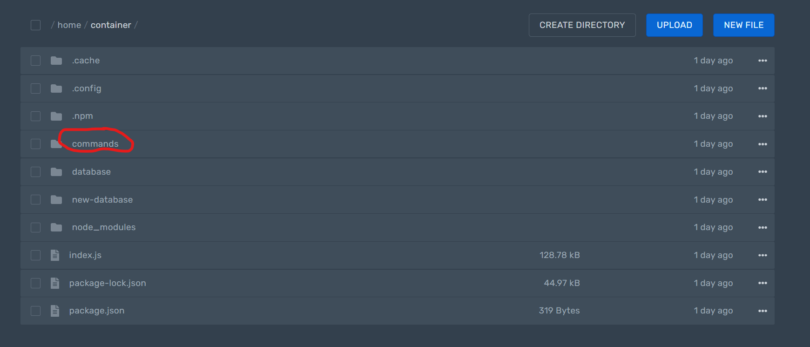
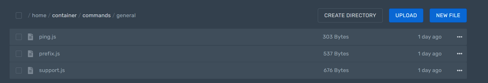

# Command Handler

## What is a command handler?

## How to setup the command handler?

### Create the commands folder

Simple! Just add a folder called `commands` in your main branch of your files.



## Edit the main file

Add the following code into your main file below your client setup:

```javascript
client.commandHandler(path, defaultCommandType, log))
```

### Options

* `path` => The file path the command files are in
* `defaultCommandType` => a string for the default command type (e.g. `'prefixedCommand'`) (this option is optional, defaults to `prefixedCommand`.)
* `log` => Whether to log the status of the command handler update (boolean, type `true` or `false`, this option is optional, defaults to true.)


This must be **below** the client setup!


### Example:

```
client.commandHandler('./commands', 'prefixedCommand', true)
```


```javascript
const CDC = require('cdc-bot.js')
const client = new CDC.Client({
// client options here
}) 

client.commandHandler('./commands')
```


### How to setup a single file in it?

Create a javascript file in the file like `exampleName.js` like in the image below:



In the file you type the following:

```javascript
module.exports = {
name: "command_name",
code: `
Your code here...
`
}
```

### Different command types

Just add the command type in the `type` option in the module like in the example below:

```javascript
module.exports = {
type: 'nonPrefixedCommand',
name: 'hi',
code: `
Hello $user[name]!
`
}
```

### Multiple commands in one file

Add a `[` after the `module.exports = ` and a `]` at the end of the file. Seperate commands with a `,` .

```javascript
module.exports = [{
type: 'nonPrefixedCommand',
name: 'hi',
code: `
Hello $user[name]!
`
}, // seperate with a comma, then add the next command object
{
type: 'nonPrefixedCommand',
name: 'bye',
code: `
Bye $user[name]!
`
}] // close with a [ at the end
```


The commands only work with using the command handler, if you setup the command objects correctly, the command type is set corrently, the file name ends with `.js` and are in the commands folder.


### Sub folders

> Can I use sub folders to organize my files?

Of course you can! Just create folders inside the commands folder

### Updating the commands

Head over to the [$updateHandlers](../functions/code-functions/usdupdatehandlers.md) page.


[usdupdatehandlers.md](../functions/code-functions/usdupdatehandlers.md)


## Extras

### Default command type

Did you know that you can change the default command type of your command handler's files? If no code property was set in a command handler file the client will automatically count it as the given default command type. Default option is set to `prefixedCommand`. Add the following to your command handler setup line and replace the `prefixedCommand` with your default command type:

```
client.commandHandler('./commands', 'prefixedCommand')
```

This options are optional.

### Disable logging command handler

You don't want the command updates be logged in your console?

Then add false in the third field of the command handler setup line:

```
client.commandHandler('./commands', 'prefixedCommand', false)
```

